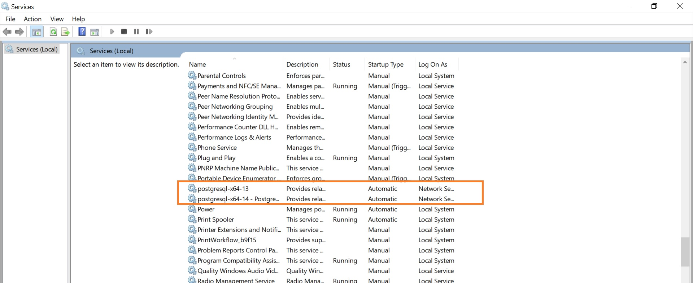

This is a [Next.js](https://nextjs.org/) project bootstrapped with [`create-next-app`](https://github.com/vercel/next.js/tree/canary/packages/create-next-app).

## Getting Started

First, run the development server:

```bash
npm run dev
# or
yarn dev
```

Open [http://localhost:3000](http://localhost:3000) with your browser to see the result.

You can start editing the page by modifying `pages/index.js`. The page auto-updates as you edit the file.

[API routes](https://nextjs.org/docs/api-routes/introduction) can be accessed on [http://localhost:3000/api/hello](http://localhost:3000/api/hello). This endpoint can be edited in `pages/api/hello.js`.

The `pages/api` directory is mapped to `/api/*`. Files in this directory are treated as [API routes](https://nextjs.org/docs/api-routes/introduction) instead of React pages.

## State management

This project uses [Redux Toolkit](https://redux-toolkit.js.org/usage/usage-with-typescript) for state management.

## Realtime management

By default realtime is disabled on the database. You need to activate it on a table by table approach. More [info](https://supabase.com/docs/guides/api#managing-realtime).

## Supabase Docker Config

Create a separate environment in Jelastic for Supabase services by adding a Docker Engine CE. [Here](https://docs.jelastic.com/docker-engine-deployment/) is a description of the process.

Add a NGINX web server to provide a SSL certificate and direct connections to the Docker container. In the `nginx-jelastic.conf` file, specify the path to the private IP address of the Docker container: 
```bash
upstream default_upstream {
    server 10.101.23.135:8000;   ### Private IP Address ###
    sticky path=/; keepalive 100;
}
```
Then restart the NGINX server.

Navigate to `/docker` folder inside the newly created container. Run `docker-compose up -d` in terminal. The following services should be up and running:


`docker ps` : Display running containers.

`docker exec -it <container name> /bin/bash` : SSH into running container.

`rm -r /var/lib/data` : Remove postgres volume,

[Official doc](https://supabase.com/docs/guides/local-development).

### Connect to Docker Postgres DB with client PgAdmin

## Local


Make sure [windows postgres services](https://github.com/sameersbn/docker-postgresql/issues/112) are disabled in case of pgAdmin password error. Here is a capture of the Windows services details (type `services` in search bar):


## Distant

Make sure to set up an [external connection endpoint](https://jelastic.com/blog/how-to-connect-to-your-docker-container-inside-jelastic-cloud/). Pay attention to the private port (5433).


Create a new server in pgAdmin with the following data:


All Supabase active containers on the server (`docker ps`):


## Cron

Start a cron job to fetch live fixtures by adding this line to the nodejs file inside server's cron folder:
`* * * * * wget -O - https://thisisfan.com/api/api-football/fetch-live-fixtures >/dev/null 2>&1`
